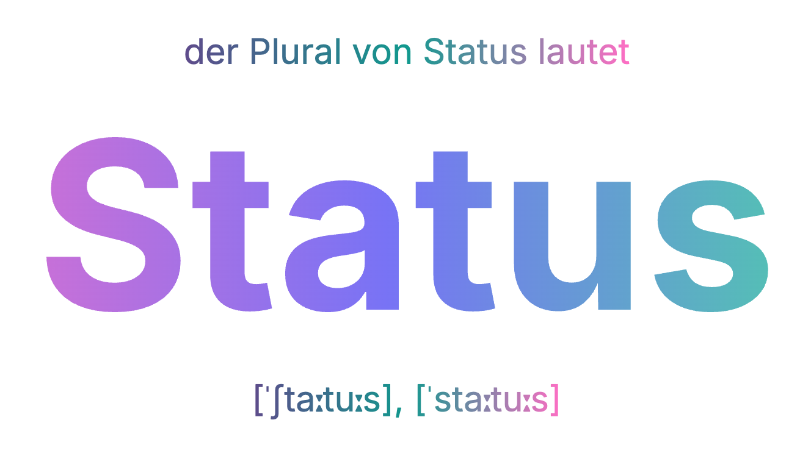

# Status Plural

Dieses Repository enthält eine einfache statische Website, die den Plural von "Status" anzeigt.

## Inhalt

- Darstellung des Plurals von "Status"
- Lautschrift
- Verweise auf Duden, DWDS und Wiktionary

## Vorschau

## Lizenz

MIT License. Siehe [LICENSE](LICENSE).

